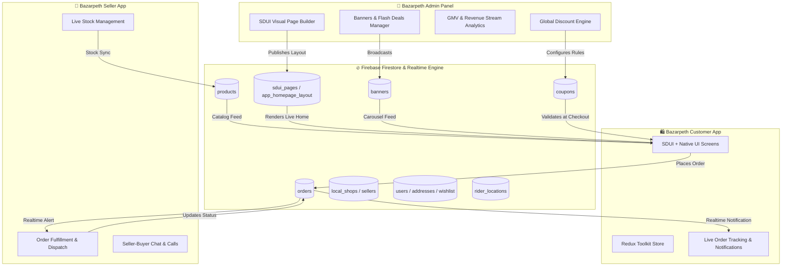
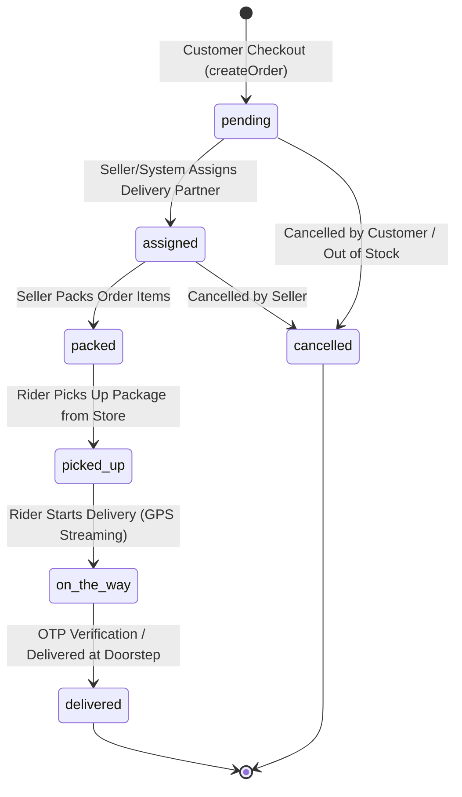

# 📱 Bazarpeth Customer App — Master Feature Registry & Integration Blueprint

> **Master Architecture Document**  
> **Target Ecosystem**: Bazarpeth 3-Way Ecosystem (`Bazarpeth Customer App` ↔ `Bazarpeth Seller App` ↔ `Bazarpeth Admin Panel`)  
> **Last Audited**: August 2026  
> **Status**: Production-Ready Blueprint

---

## 📑 Table of Contents
1. [Executive Ecosystem Architecture](#1-executive-ecosystem-architecture)
2. [Complete Screen Registry (26 Screens + Tab Modules)](#2-complete-screen-registry)
3. [Server-Driven UI (SDUI) Widget Registry](#3-server-driven-ui-sdui-widget-registry)
4. [State Machines & Redux Global Store](#4-state-machines--redux-global-store)
5. [Firestore Database Schema & API Mapping](#5-firestore-database-schema--api-mapping)
6. [3-Way Cross-App Sync Blueprint](#6-3-way-cross-app-sync-blueprint)
   - [Customer App ↔ Seller App Protocols](#customer-app--seller-app-protocols)
   - [Customer App ↔ Admin Panel Protocols](#customer-app--admin-panel-protocols)
   - [Customer App ↔ Delivery Partner GPS Protocols](#customer-app--delivery-partner-gps-protocols)

---

## 1. Executive Ecosystem Architecture



---

## 2. Complete Screen Registry

| # | Screen File Path | Navigation Route | Primary Purpose & Features | UI Framework / Tech |
|---|---|---|---|---|
| 1 | `src/screens/WelcomeScreen.tsx` | `Welcome` | Brand onboarding, value props, language/region entry | React Native + NativeWind |
| 2 | `src/screens/LoginScreen.tsx` | `Login` | Mobile OTP & Email/Password login, reCAPTCHA modal | React Native + Firebase Auth + Recaptcha |
| 3 | `src/screens/SignupScreen.tsx` | `Signup` | New customer onboarding, profile creation | React Native + Firebase Auth |
| 4 | `src/screens/HomeScreen.tsx` | `MainTabs > Home` | Multi-category dynamic tab homepage, Meesho-style squircle categories, stories, flash deals, SDUI dynamic sections | React Native + NativeWind + Reanimated + SDUI |
| 5 | `src/screens/CategoriesScreen.tsx` | `MainTabs > Categories` | Master 2-tier visual category taxonomy explorer with category counts & subcategory browsing | React Native + NativeWind |
| 6 | `src/screens/FeriwalaScreen.tsx` | `MainTabs > LocalShops` | Local Sangamner shops & street vendors explorer, store verification badge, direct shop contact | React Native + NativeWind |
| 7 | `src/screens/CartScreen.tsx` | `MainTabs > Cart` | Multi-item basket, quantity increments, promo coupon validation, bill breakdown (subtotal, delivery, savings) | React Native + Redux (`cartSlice`) |
| 8 | `src/screens/CheckoutScreen.tsx` | `Checkout` | Delivery address picker/creator, Razorpay Gateway (Web + Native SDK) + Cash on Delivery toggle, order submission | React Native + Razorpay + Firestore |
| 9 | `src/screens/OrderSuccessScreen.tsx` | `OrderSuccess` | Order placement confirmation, order ID badge, animated delivery prompt, direct link to live tracking | React Native + NativeWind |
| 10 | `src/screens/OrdersScreen.tsx` | `Orders` | Real-time user order history, status badges (`pending`, `packed`, `picked_up`, `delivered`), one-click re-track | React Native + Firestore (`orders`) |
| 11 | `src/screens/DeliveryTrackingScreen.tsx` | `DeliveryTracking` | Live GPS interactive rider tracking, 4-stage lifecycle timeline, rider contact (call/SMS), delivery address card | React Native + LiveOrderMap + Firestore (`rider_locations`) |
| 12 | `src/screens/ProductDetailScreen.tsx` | `ProductDetail` | High-res image carousel, price discount badge, variant selection, seller store chip, related products, product reviews & ratings | React Native + Redux + Firestore |
| 13 | `src/screens/ShopDetailScreen.tsx` | `ShopDetail` | Seller store header, contact action, store opening hours, verified badge, product catalog filtered by shop ID | React Native + Firestore |
| 14 | `src/screens/CategoryProductsScreen.tsx` | `CategoryProducts` | Filterable & sortable product grid by category / subcategory with quick add-to-cart | React Native + Firestore |
| 15 | `src/screens/SearchScreen.tsx` | `Search` | Real-time debounced product search, recent searches, voice/image search triggers | React Native + NativeWind |
| 16 | `src/screens/WishlistScreen.tsx` | `Wishlist` | Customer saved items, real-time sync with user subcollection, instant move-to-cart | React Native + Firestore (`users/{uid}/wishlist`) |
| 17 | `src/screens/SavedShopsScreen.tsx` | `SavedShops` | Bookmarked local stores and favorites | React Native + Firestore (`users/{uid}/savedShops`) |
| 18 | `src/screens/AddressesScreen.tsx` | `Addresses` | Address management (Add, Edit, Delete, Set as Default), geo-location coordinates | React Native + Firestore (`users/{uid}/addresses`) |
| 19 | `src/screens/ProfileScreen.tsx` | `MainTabs > Profile` | Customer profile summary, orders/wishlist shortcuts, language switcher, support links, logout | React Native + Redux (`profileSlice`) |
| 20 | `src/screens/EditProfileScreen.tsx` | `EditProfile` | Customer name, phone, email, avatar image upload | React Native + Firebase Storage + Firestore |
| 21 | `src/screens/HelpSupportScreen.tsx` | `HelpSupport` | Customer FAQ accordion, WhatsApp support launch, call center hotline | React Native + NativeWind |
| 22 | `src/screens/AboutUsScreen.tsx` | `AboutUs` | Company mission, Indian Bazarpeth Pvt. Ltd. company information & trust credentials | React Native |
| 23 | `src/screens/SplashScreen.tsx` | N/A (Root) | Safe splashscreen dismisser & asset preloader | React Native + `expo-splash-screen` |
| 24 | `src/screens/AnimatedSplashScreen.tsx` | N/A | Lottie brand introduction splash animation | React Native + Lottie |
| 25 | `src/screens/YoutubeVideoPlayer.tsx` | Component/Modal | Product video review & demo player (Web + Native) | `react-native-youtube-iframe` |
| 26 | `src/screens/tabs/AllTab.tsx` / `WomenTab.tsx` / `MenTab.tsx` / `KidsTab.tsx` / `LocalShopsTab.tsx` | Dynamic Tab Layouts | Dynamic tab feed renderers utilizing tab-specific color palettes and SDUI blocks | React Native + SDUI Universal Renderer |

---

## 3. Server-Driven UI (SDUI) Widget Registry

The Customer App is driven by dynamic layouts fetched from Firestore collection `app_homepage_layout` / `sdui_pages`. The following **15 SDUI widgets** are supported:

| Widget Key (`type`) | Component File | Description & Visual Layout | Key Data Properties |
|---|---|---|---|
| `ZEPTO_ETA_BAR` / `zepto_eta_bar` | `ZeptoEtaBarWidget.tsx` | Floating quick-commerce ETA bar with live minutes counter and free delivery progress tracker | `etaMinutes`, `locationText`, `freeDeliveryThreshold`, `currentCartValue` |
| `MEESHO_SHARE_EARN` / `meesho_share_earn` | `MeeshoShareEarnWidget.tsx` | Reseller banner incentivizing customers to share product catalogs on WhatsApp to earn margin | `title`, `resellerMargin`, `badgeText`, `shareMessage`, `buttonText` |
| `AMAZON_BANK_OFFERS` / `amazon_bank_offers` | `AmazonBankOffersWidget.tsx` | Horizontal cards displaying bank credit card discounts, instant cashback, and copyable coupon codes | `offers: [{ bankName, discountText, minOrder, couponCode, logoUrl }]` |
| `SHOP_THE_LOOK` / `shop_the_look` | `ShopTheLookWidget.tsx` | Interactive lifestyle hero image with clickable hotspots linking to individual apparel/accessories | `lifestyleImageUrl`, `hotspots: [{ xPercent, yPercent, productTitle, price, productId }]` |
| `FLASH_SALE` / `flash_sale` | `FlashSaleWidget.tsx` | High-urgency deal block with live countdown timer, claimed percentage progress bar, and discounted items | `endsAt`, `durationHours`, `claimedPercent`, `productIds`, `items` |
| `COUNTDOWN_TIMER` | `CountdownTimerWidget.tsx` | Standalone animated timer with gradient background for festive sales | `endsAt`, `title`, `subtitle`, `bgGradient` |
| `HERO_BANNER` / `hero_banner` | `HeroBannerWidget.tsx` | Auto-playing full-width banner carousel with CTA buttons and deep-link routing | `banners: [{ imageUrl, title, ctaText, link, bgColor }]` |
| `ARCH_GRID` / `arch_grid` | `ArchGridWidget.tsx` | Elegant Mughal/Indian arched visual grid displaying curated festive & traditional collections | `columns: 2 \| 3`, `items: [{ imageUrl, title, tag, link }]` |
| `TAG_GRID` / `tag_shaped_cards` | `TagShapedCardsWidget.tsx` | Discount badge-shaped cards highlighting price-drop categories (e.g., "Under ₹199", "Under ₹499") | `items: [{ title, tag, imageUrl, bgColor, link }]` |
| `MASONRY_FEED` / `masonry_feed` | `MasonryFeedWidget.tsx` | Pinterest-style staggered 2-column infinite product feed | `productIds`, `category`, `title` |
| `HORIZONTAL_SCROLL` / `carousel_slider` | `HorizontalScrollWidget.tsx` | Smooth horizontal snapping carousel for trending products, brands, or newly added local stores | `items: [{ imageUrl, title, price, originalPrice, link }]`, `viewAllLink` |
| `SQUARE_GRID_3X3` / `square_grid_3x3` | `SquareGrid3x3Widget.tsx` | 3x3 category grid for quick visual navigation | `items: [{ title, imageUrl, link, tag }]` |
| `TRUST_BADGES` / `trust_badges` | `TrustBadgesWidget.tsx` | Reassurance strip (100% Original, 7-Day Returns, Free Delivery, Sangamner Verified) | `badges: [{ icon, title, subtitle }]` |
| `SPIN_WHEEL_REWARD` / `spin_wheel_reward` | `SpinWheelRewardWidget.tsx` | Interactive gamified lucky draw wheel rewarding customers with instant checkout discount coupons | `rewardCoupons: [{ label, code, discount }]` |
| `AI_RECOMMENDED` / `ai_recommended` | `AiRecommendedWidget.tsx` | Personalized product recommendations based on browsing category and past orders | `algorithm`, `productIds` |

---

## 4. State Machines & Redux Global Store

The global state is managed via Redux Toolkit (`src/store/index.ts`):

```
Store Root
├── auth (`authSlice.ts`)          --> User auth session (uid, email, displayName, isAuthenticated)
├── profile (`profileSlice.ts`)    --> Firestore user profile (phone, addresses, preferences)
├── cart (`cartSlice.ts`)          --> Items, quantities, subtotals, item counts (persisted to Firestore)
├── order (`orderSlice.ts`)        --> Live orders array, selected order, tracking status
├── product (`productSlice.ts`)    --> Product catalog cache, selected category filter, search query
├── wishlist (`wishlistSlice.ts`)  --> Bookmarked product IDs & metadata
├── coupon (`couponSlice.ts`)      --> Active applied coupon, discount amount calculation
├── flashDeal (`flashDealSlice.ts`)--> Active flash deals with start/end timestamps
└── review (`reviewSlice.ts`)      --> Product ratings & reviews cache
```

### Order State Lifecycle Machine



---

## 5. Firestore Database Schema & API Mapping

| Collection Name | Document ID | Read By (Customer App) | Written By (Customer App) | Core Fields & Schema Structure |
|---|---|---|---|---|
| `products` | `{productId}` | `HomeScreen`, `ProductDetailScreen`, `CategoryProductsScreen`, `SearchScreen` | `addReview()` (updates rating & reviewCount) | `{ name: string, price: number, originalPrice: number, category: string, subcategory?: string, images: string[], shopId: string, shopName: string, stock: number, rating: number, reviewCount: number, status: 'Active' \| 'Inactive', city: string }` |
| `local_shops` | `{shopId}` | `FeriwalaScreen`, `ShopDetailScreen`, `HomeScreen` | *None (Read-only)* | `{ name: string, ownerName: string, category: string, address: string, phone: string, isVerified: boolean, rating: number, image: string, city: string, openingHours: string }` |
| `orders` | `{orderId}` (Auto) | `OrdersScreen`, `DeliveryTrackingScreen` (via `onSnapshot`) | `CheckoutScreen` (via `createOrder()`) | `{ userId: string, items: Array<{ id, name, price, quantity, image, shopId }>, totalAmount: number, subtotal: number, deliveryFee: number, discountAmount: number, appliedCoupon: string \| null, shippingAddress: object, customerLocation: { latitude, longitude, address }, status: 'pending' \| 'assigned' \| 'packed' \| 'picked_up' \| 'delivered' \| 'cancelled', paymentMethod: 'cod' \| 'online', paymentStatus: 'paid' \| 'pending', riderId?: string, createdAt: timestamp, updatedAt: timestamp }` |
| `carts` | `{userId}` | `CartScreen` | `saveCartToFirestore()` | `{ items: CartItem[], updatedAt: timestamp }` |
| `coupons` | `{couponId}` | `CartScreen`, `CheckoutScreen` (`validateCoupon()`) | *None (Read-only)* | `{ code: string, type: 'flat' \| 'percentage', value: number, maxDiscount?: number, minOrderValue: number, usageLimit?: number, usedCount: number, isActive: boolean, expiryDate: timestamp }` |
| `banners` | `{bannerId}` | `HomeScreen`, `HeaderBannerCarousel` | *None (Read-only)* | `{ title: string, subtitle?: string, imageUrl: string, ctaText?: string, link?: string, targetTab?: string, displayOrder: number, status: 'active', city?: string }` |
| `flash_deals` | `{dealId}` | `FlashDealsFeed`, `FlashSaleWidget` | *None (Read-only)* | `{ title: string, productIds: string[], startTime: timestamp, endTime: timestamp, status: 'active' \| 'expired' }` |
| `categories` | `{catId}` | `CategoriesScreen`, `HomeScreen` | *None (Read-only)* | `{ name: string, icon: string, imageUrl: string, order: number, subcategories: string[] }` |
| `app_homepage_layout` | `{tabName}` (`all`, `women`, etc.) | `HomeScreen` (`getTabHomepageLayout()`) | *None (Read-only)* | `{ tab: string, blocks: LayoutBlock[], updatedAt: timestamp }` |
| `users` | `{uid}` | `ProfileScreen`, `RootNavigator` | `saveUserPushToken()`, `EditProfileScreen` | `{ name: string, email: string, phone: string, pushToken: string, photoURL?: string, updatedAt: timestamp }` |
| `users/{uid}/addresses` | `{addressId}` | `AddressesScreen`, `CheckoutScreen` | `saveAddress()`, `deleteAddress()`, `setDefaultAddress()` | `{ fullName: string, phone: string, addressLine1: string, addressLine2?: string, city: string, state: string, pincode: string, type: 'Home' \| 'Work', isDefault: boolean, latitude?: number, longitude?: number }` |
| `users/{uid}/wishlist` | `{productId}` | `WishlistScreen`, `ProductDetailScreen` | `toggleWishlistItem()` | `{ id: string, name: string, price: number, image: string, addedAt: timestamp }` |
| `users/{uid}/savedShops` | `{shopId}` | `SavedShopsScreen`, `ShopDetailScreen` | `toggleSavedShop()` | `{ id: string, name: string, category: string, image: string, savedAt: timestamp }` |
| `rider_locations` | `{riderId}` | `DeliveryTrackingScreen` (via `onSnapshot`) | *None (Written by Rider/Seller App)* | `{ latitude: number, longitude: number, heading: number, speed: number, updatedAt: timestamp }` |
| `products/{productId}/reviews` | `{reviewId}` | `ProductDetailScreen` | `addReview()` | `{ userId: string, userName: string, rating: number, comment: string, createdAt: timestamp }` |

---

## 6. 3-Way Cross-App Sync Blueprint

### Customer App ↔ Seller App Protocols

1. **Order Submission Payload (`orders` Collection)**:
   - When a customer checks out on `CheckoutScreen`, the payload written to Firestore contains:
     ```json
     {
       "shopId": "shop_sangamner_01",
       "customerId": "usr_98765",
       "userId": "usr_98765",
       "items": [
         {
           "id": "prod_101",
           "productId": "prod_101",
           "name": "Kolhapuri Chappal",
           "price": 499,
           "quantity": 1,
           "shopId": "shop_sangamner_01",
           "image": "https://..."
         }
       ],
       "totalAmount": 539,
       "subtotal": 499,
       "deliveryFee": 40,
       "discountAmount": 0,
       "shippingAddress": {
         "fullName": "Swaroop Ghadi",
         "phone": "+91 9876543210",
         "addressLine1": "Near Market Yard",
         "city": "Sangamner",
         "pincode": "422605"
       },
       "customerLocation": {
         "latitude": 19.5761,
         "longitude": 74.2070,
         "address": "Near Market Yard, Sangamner, 422605"
       },
       "status": "pending",
       "paymentMethod": "cod",
       "paymentStatus": "pending"
     }
     ```
   - **Seller App Action**: The Seller App listens to `query(collection(db, 'orders'), where('shopId', '==', sellerShopId))` and displays instant sound & visual order alerts.
2. **Live Inventory Handshake (`products` Collection)**:
   - On checkout, `createOrder()` executes an atomic `writeBatch` on Firestore:
     ```javascript
     batch.update(productRef, { stock: increment(-quantity), updatedAt: serverTimestamp() });
     ```
   - If stock reaches `0`, product status shifts to Sold Out.
3. **Real-Time Status Synchronization**:
   - The Seller App updates order status (`preparing` -> `packed` -> `out_for_delivery` -> `delivered`).
   - Customer App `DeliveryTrackingScreen` receives the real-time `onSnapshot` delta and instantly updates the 4-stage delivery timeline and status chip without reloading.


---

### Customer App ↔ Admin Panel Protocols

1. **Server-Driven UI (SDUI) Live Publishing**:
   - Admin Panel uses the visual drag-and-drop page builder to reorder widgets, add flash sales, and configure festive banners.
   - Admin writes the JSON block schema to `app_homepage_layout/{tab}` or `sdui_pages/home`.
   - Customer App loads the updated layout without needing any app store release.
2. **Global Coupon Engine**:
   - Admin creates coupons in `coupons/{couponCode}` with usage limits and minimum order values.
   - Customer App checks and increments `usedCount` upon order completion.
3. **Broadcast Notification Banners**:
   - Admin creates banners in `banners`.
   - Customer App automatically filters banners matching customer city (`city === 'Sangamner'` or `city === 'global'`) and active tab.

---

## 7. Verification & Readiness Status

- [x] **26 Screens Fully Registered & Tested**
- [x] **15 SDUI Widgets Implemented & Compatible with Firestore Schemas**
- [x] **Crash-free Android 12+ Boot Profile Verified**
- [x] **EAS Preview APK Built Successfully**
- [x] **Real-time GPS Tracking & Notification Service Configured**

*Document generated and registered in the workspace root: [customer_feature_registry.md](file:///e:/Swaroop%20Ghadi/Vayumaan%20Industries%20Pvt.%20Ltd/Indian%20Bazarpeth%20pvt.ltd/Bazarpeth.com/Bazarpeth.com/customer_feature_registry.md)*
